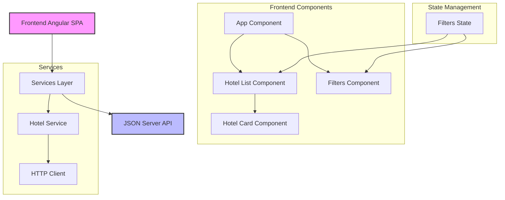

# Arquitectura de la Aplicación

## Diagrama de Arquitectura

## Decisiones Técnicas

### 1. Arquitectura y Estructura
- **Standalone Components**: Elegidos por su mejor tree-shaking y modularidad
- **Servicios Centralizados**: Toda la lógica de API en HotelService para mejor mantenibilidad
- **Interfaces Tipadas**: Uso extensivo de TypeScript para seguridad de tipos

### 2. Gestión de Estado
- Estado local en componentes para simplicidad
- Eventos para comunicación padre-hijo (@Output)
- Evitado state management complejo (NgRx) por escala del proyecto

### 3. Rendimiento
- Lazy loading de librerías externas (vanilla-tilt)
- Paginación en servidor para datasets grandes
- Debounce en filtros de texto para reducir llamadas API

### 4. UX/UI
- Bootstrap para base responsive
- Animaciones nativas CSS para mejor rendimiento
- Feedback visual en interacciones (loading states, transitions)

### 5. Testing
- Unit tests para lógica de negocio crítica
- Mocks para servicios HTTP
- Fixtures para datos de prueba

## Flujo de Datos

1. **Capa de UI**
   - Componentes Standalone
   - Manejo de eventos de usuario
   - Presentación de datos

2. **Capa de Servicios**
   - Abstracción de API
   - Transformación de datos
   - Manejo de errores

3. **Capa de Datos**
   - JSON Server
   - Interfaces tipadas
   - Modelos de datos